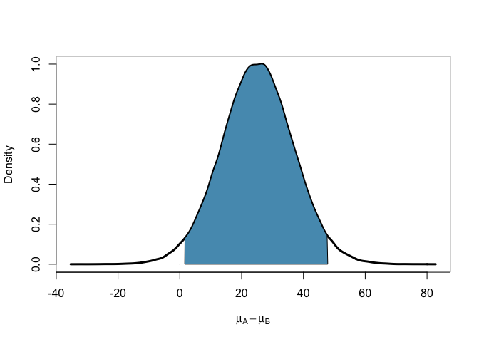

Comparing two independent means
================
Dr Merlise Clyde, Duke University

Define the data using summary statistics

``` r
y = c(52.1, 27.1)
grp=c(1,2)
sd=c(45.1, 26.4) 
n=c(22,22)
```

Source functions for slides

``` r
source("behren-fisher.R")
```

``` r
set.seed(42)
out = BFt.test(y = c(52.1, 27.1), sd=c(45.1, 26.4), n=c(22,22), 
               method="independent.Jeffreys", colHPD=myblue, nsim=100000,
               suff=T, main="", xlab=expression(mu[A] - mu[B]), lwd=3, plot=T)
```

    ## Loading required package: cubature

    ## Loading required package: R2WinBUGS

    ## Loading required package: coda

    ## Loading required package: boot



``` r
out$ci
```

    ##         lower    upper
    ## var1 1.586604 47.86902
    ## attr(,"Probability")
    ## [1] 0.95

This is based on simulating from the posterior distribution so the credible interval may change slighly if different random seeds are used or if more simulations are used.
