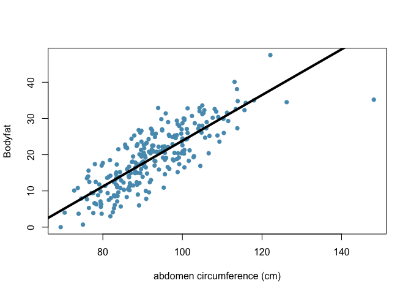
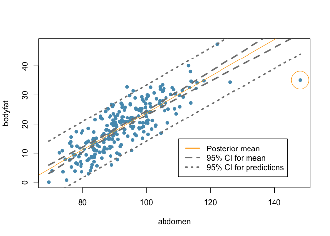

Bayesian linear regression
================
Dr Merlise A Clyde, Duke University

### Read in the data

``` r
library(BAS)
data(bodyfat)
summary(bodyfat)
```

    ##     Density         Bodyfat           Age            Weight     
    ##  Min.   :0.995   Min.   : 0.00   Min.   :22.00   Min.   :118.5  
    ##  1st Qu.:1.041   1st Qu.:12.47   1st Qu.:35.75   1st Qu.:159.0  
    ##  Median :1.055   Median :19.20   Median :43.00   Median :176.5  
    ##  Mean   :1.056   Mean   :19.15   Mean   :44.88   Mean   :178.9  
    ##  3rd Qu.:1.070   3rd Qu.:25.30   3rd Qu.:54.00   3rd Qu.:197.0  
    ##  Max.   :1.109   Max.   :47.50   Max.   :81.00   Max.   :363.1  
    ##      Height           Neck           Chest           Abdomen      
    ##  Min.   :29.50   Min.   :31.10   Min.   : 79.30   Min.   : 69.40  
    ##  1st Qu.:68.25   1st Qu.:36.40   1st Qu.: 94.35   1st Qu.: 84.58  
    ##  Median :70.00   Median :38.00   Median : 99.65   Median : 90.95  
    ##  Mean   :70.15   Mean   :37.99   Mean   :100.82   Mean   : 92.56  
    ##  3rd Qu.:72.25   3rd Qu.:39.42   3rd Qu.:105.38   3rd Qu.: 99.33  
    ##  Max.   :77.75   Max.   :51.20   Max.   :136.20   Max.   :148.10  
    ##       Hip            Thigh            Knee           Ankle     
    ##  Min.   : 85.0   Min.   :47.20   Min.   :33.00   Min.   :19.1  
    ##  1st Qu.: 95.5   1st Qu.:56.00   1st Qu.:36.98   1st Qu.:22.0  
    ##  Median : 99.3   Median :59.00   Median :38.50   Median :22.8  
    ##  Mean   : 99.9   Mean   :59.41   Mean   :38.59   Mean   :23.1  
    ##  3rd Qu.:103.5   3rd Qu.:62.35   3rd Qu.:39.92   3rd Qu.:24.0  
    ##  Max.   :147.7   Max.   :87.30   Max.   :49.10   Max.   :33.9  
    ##      Biceps         Forearm          Wrist      
    ##  Min.   :24.80   Min.   :21.00   Min.   :15.80  
    ##  1st Qu.:30.20   1st Qu.:27.30   1st Qu.:17.60  
    ##  Median :32.05   Median :28.70   Median :18.30  
    ##  Mean   :32.27   Mean   :28.66   Mean   :18.23  
    ##  3rd Qu.:34.33   3rd Qu.:30.00   3rd Qu.:18.80  
    ##  Max.   :45.00   Max.   :34.90   Max.   :21.40

### Scatterplot and OLS line

``` r
myblue = rgb(86,155,189, name="myblue", max=256)
mydarkgrey = rgb(.5,.5,.5, name="mydarkgrey", max=1)

bodyfat.lm = lm(Bodyfat ~ Abdomen, data=bodyfat)

plot(Bodyfat ~ Abdomen, data=bodyfat, 
     xlab="abdomen circumference (cm)", 
     col=myblue, pch=16, main="")
beta = coef(bodyfat.lm)
abline(beta, lwd=4, col=1)
```



### Posterior distribution using the reference prior

We will use `lm` to obtain the OLS estimates which provide the posterior mean and standard deviation, while the `confint` function provides confidence intervals, which under the reference prior are 95% credible intervals. The code below extracts them and just relabels the output.

``` r
summary(bodyfat.lm)
```

    ## 
    ## Call:
    ## lm(formula = Bodyfat ~ Abdomen, data = bodyfat)
    ## 
    ## Residuals:
    ##      Min       1Q   Median       3Q      Max 
    ## -19.0160  -3.7557   0.0554   3.4215  12.9007 
    ## 
    ## Coefficients:
    ##              Estimate Std. Error t value Pr(>|t|)    
    ## (Intercept) -39.28018    2.66034  -14.77   <2e-16 ***
    ## Abdomen       0.63130    0.02855   22.11   <2e-16 ***
    ## ---
    ## Signif. codes:  0 '***' 0.001 '**' 0.01 '*' 0.05 '.' 0.1 ' ' 1
    ## 
    ## Residual standard error: 4.877 on 250 degrees of freedom
    ## Multiple R-squared:  0.6617, Adjusted R-squared:  0.6603 
    ## F-statistic: 488.9 on 1 and 250 DF,  p-value: < 2.2e-16

``` r
out = summary(bodyfat.lm)$coef[, 1:2]
out = cbind(out, confint(bodyfat.lm))
colnames(out) = c("posterior mean", "sd", "2.5", "97.5")
round(out, 2)
```

    ##             posterior mean   sd    2.5   97.5
    ## (Intercept)         -39.28 2.66 -44.52 -34.04
    ## Abdomen               0.63 0.03   0.58   0.69

### credible intervals for the mean and prediction

``` r
x = bodyfat$Abdomen
y= bodyfat$Bodyfat
xnew <- seq(min(x), max(x), length.out = 100)
ynew <- data.frame(predict(bodyfat.lm, newdata = data.frame(Abdomen = xnew), 
                   interval = "confidence", level = 0.95))
plot(x,y, xlab = "abdomen", ylab="bodyfat", col=myblue, pch=16)
lines(ynew$lwr ~ xnew, lty = 2, lwd=3, col=mydarkgrey)
lines(ynew$upr ~ xnew, lty = 2, lwd=3, col=mydarkgrey)
abline(bodyfat.lm, col="orange")
ynew <- data.frame(predict(bodyfat.lm, newdata = data.frame(Abdomen = xnew), 
                   interval = "prediction", level = 0.95))
lines(ynew$lwr ~ xnew, lty = 3, lwd=3, col=mydarkgrey)
lines(ynew$upr ~ xnew, lty = 3, lwd=3, col=mydarkgrey)
points(bodyfat[39,"Abdomen"], bodyfat[39,"Bodyfat"], col="orange", cex=5)
legend(110,15, legend=c("Posterior mean", "95% CI for mean", "95% CI for predictions"), 
       col=c("orange",rep(mydarkgrey, 2)), lwd=3, lty=c(1,2, 3))
```



### Outliers

``` r
source("bayes-outliers.R")
library(mvtnorm)
outliers= Bayes.outlier.prob(bodyfat.lm)
prob.39 = outliers$prob.outlier[39]
prob.39
```

    ## [1] 0.9916833

``` r
n = nrow(bodyfat)
k = qnorm(.5 + .5*.95^(1/n))
outliers.no= Bayes.outlier.prob(bodyfat.lm, k=k)
prob.no.39 = outliers.no$prob.outlier[39]
prob.no.39
```

    ## [1] 0.6847509
