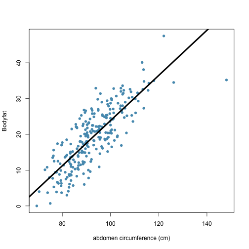
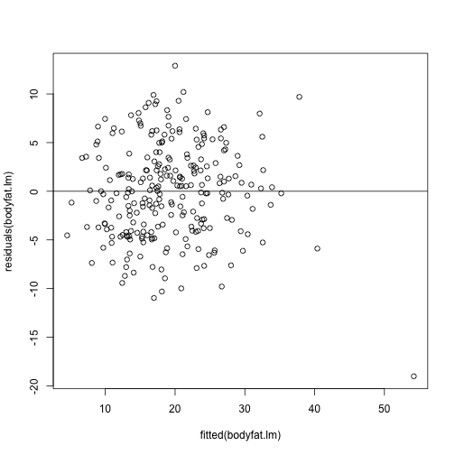
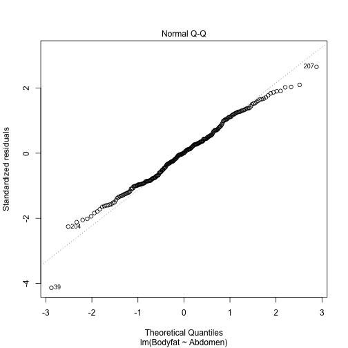
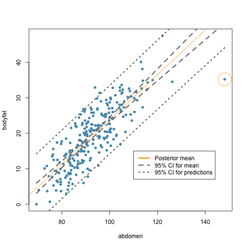

---
title: "Bayesian linear regression"
author: Dr Merlise A Clyde, Duke University
output: md_document


In this section, we turn to Bayesian inference in simple linear regression. We will use a reference prior distribution that provides a connection between the frequentist solution and Bayesian answers. This provides a baseline analysis for comparison with more informative prior distributions. To illustrate the ideas, we'll use an example to predict body fat. Obtaining accurate measurements of body fat is expensive and not something that can be done easily at home. Instead predictive models that can predict the percentage of body fat using readily available measurements such as abdominal circumference are easy to use and inexpensive. We illustrate this using the `bodyfat` data from the library `BAS`. 

To start, download the `BAS` package from CRAN (if you have not installed it already) and load the library to access the dataframe.  


```r
library(BAS)
data(bodyfat)
summary(bodyfat)
```

```
##     Density         Bodyfat           Age            Weight     
##  Min.   :0.995   Min.   : 0.00   Min.   :22.00   Min.   :118.5  
##  1st Qu.:1.041   1st Qu.:12.47   1st Qu.:35.75   1st Qu.:159.0  
##  Median :1.055   Median :19.20   Median :43.00   Median :176.5  
##  Mean   :1.056   Mean   :19.15   Mean   :44.88   Mean   :178.9  
##  3rd Qu.:1.070   3rd Qu.:25.30   3rd Qu.:54.00   3rd Qu.:197.0  
##  Max.   :1.109   Max.   :47.50   Max.   :81.00   Max.   :363.1  
##      Height           Neck           Chest           Abdomen      
##  Min.   :29.50   Min.   :31.10   Min.   : 79.30   Min.   : 69.40  
##  1st Qu.:68.25   1st Qu.:36.40   1st Qu.: 94.35   1st Qu.: 84.58  
##  Median :70.00   Median :38.00   Median : 99.65   Median : 90.95  
##  Mean   :70.15   Mean   :37.99   Mean   :100.82   Mean   : 92.56  
##  3rd Qu.:72.25   3rd Qu.:39.42   3rd Qu.:105.38   3rd Qu.: 99.33  
##  Max.   :77.75   Max.   :51.20   Max.   :136.20   Max.   :148.10  
##       Hip            Thigh            Knee           Ankle     
##  Min.   : 85.0   Min.   :47.20   Min.   :33.00   Min.   :19.1  
##  1st Qu.: 95.5   1st Qu.:56.00   1st Qu.:36.98   1st Qu.:22.0  
##  Median : 99.3   Median :59.00   Median :38.50   Median :22.8  
##  Mean   : 99.9   Mean   :59.41   Mean   :38.59   Mean   :23.1  
##  3rd Qu.:103.5   3rd Qu.:62.35   3rd Qu.:39.92   3rd Qu.:24.0  
##  Max.   :147.7   Max.   :87.30   Max.   :49.10   Max.   :33.9  
##      Biceps         Forearm          Wrist      
##  Min.   :24.80   Min.   :21.00   Min.   :15.80  
##  1st Qu.:30.20   1st Qu.:27.30   1st Qu.:17.60  
##  Median :32.05   Median :28.70   Median :18.30  
##  Mean   :32.27   Mean   :28.66   Mean   :18.23  
##  3rd Qu.:34.33   3rd Qu.:30.00   3rd Qu.:18.80  
##  Max.   :45.00   Max.   :34.90   Max.   :21.40
```
This includes 252 measurements on men of body fat and other measurements, such as waist circumference (Abdomen).  We will use Abdomen to illustrate Bayesian simple linear regression.   The figure below shows the percent body fat obtained from under water weighing and the abdominal circumference for 252 men. To predict body fat, the line  overlayed on the scatter plot illustrates the best fitting ordinary least squares line obtained with `lm`.

### Scatterplot and OLS line ###

```r
plot(Bodyfat ~ Abdomen, data=bodyfat, 
     xlab="abdomen circumference (cm)", 
     col=myblue, pch=16, main="")
bodyfat.lm = lm(Bodyfat ~ Abdomen, data=bodyfat)
summary(bodyfat.lm)
```

```
## 
## Call:
## lm(formula = Bodyfat ~ Abdomen, data = bodyfat)
## 
## Residuals:
##      Min       1Q   Median       3Q      Max 
## -19.0160  -3.7557   0.0554   3.4215  12.9007 
## 
## Coefficients:
##              Estimate Std. Error t value Pr(>|t|)    
## (Intercept) -39.28018    2.66034  -14.77   <2e-16 ***
## Abdomen       0.63130    0.02855   22.11   <2e-16 ***
## ---
## Signif. codes:  0 '***' 0.001 '**' 0.01 '*' 0.05 '.' 0.1 ' ' 1
## 
## Residual standard error: 4.877 on 250 degrees of freedom
## Multiple R-squared:  0.6617,	Adjusted R-squared:  0.6603 
## F-statistic: 488.9 on 1 and 250 DF,  p-value: < 2.2e-16
```

```r
beta = coef(bodyfat.lm)
abline(beta, lwd=4, col=1)
```



This has an estimated slope, $\hat{\beta}$ of 0.63 and an estimated intercept, $\hat{\alpha}$, of about -39.3%. For every additional centimeter, we expect body fat to increase by 0.63%. The negative interceptive course does not make sense as a physical model, but neither does predicting a male with a waist of zero centimeters. Nevertheless, this linear regression may be an accurate approximation for prediction purposes for measurements that are in the observed range for this population. 

The residuals, which provide an estimate of the fitting error, are equal to $\hat{\epsilon}_i = y_i = \hat{y}_i$ and are the difference between the observed $y_i$ and fitted values $\hat{y} =  \hat{\alpha} + \hat{\beta} x_i$ where $x_i$ is the abdominal circumference for the $i$th male  and are used for diagnostics as well as estimating $\sigma^2$ via the mean squared error, which is the sum of the squared errors 
$$\hat{\sigma}^2 =  \frac{\sum \hat{\epsilon}_i^2}{n-2}$$
divided by the degrees of freedom, 
where the degrees of freedom are $n - 2$ or the number of observations adjusted for the number of parameters that we estimated in the regression.  The MSE, $\hat{\sigma}^2$, maybe obtained from the output as the square of the entry labeled "residual standard error".

Since residuals and fitted values are uncorrelated with the expected value of the residuals equal to zero if the model is correct,  the scatterplot of residuals  versus fitted provides an additional visual check of the model adequacy.


```r
plot(residuals(bodyfat.lm) ~ fitted(bodyfat.lm))
abline(h=0)
```



With the exception of the one observation for the individual with the largest waist measurement, the residual plot suggest that the linear regression is a reasonable approximation.

Let's now turn to the Bayesian answer and show how to obtain a reference posterior distribution using the ordinary least squares output.

### Bayesian Estimation using the reference prior###

The Bayesian model starts with the same model as the classical frequentist:
$$Y_i = \alpha + \beta X_i + \epsilon_i$$
with the assumption that the errors $\epsilon_i$ are independent and identically distributed as normal random variables with mean zero and constant variance $\sigma^2$.  This assumption is exactly the same used for classical inference for testing and constructing confidence intervals.   The diagnostic plots from frequentist model fitting for checking residuals, may be used to help check this assumption

```r
plot(bodyfat.lm, which=2)
```



where the quantiles of the residuals (estimated errors) are plotted against their theoretical values or what we would expect if the data were normally distributed.

A conjugate analysis would use a bivariate normal distribution for the coefficients conditional on $\sigma^2$, where $\sigma$  provides scaling in term of units for the response. This corresponds to  $\alpha$ given  $\sigma^2$ being normally distributed 
$$\alpha \mid \sigma^2 \sim N(a_0, \sigma^2 S_{\alpha})$$
with a mean $a_0$, and a variance controlled by the parameter $S_{\alpha}$ that controls how concentrated our prior beliefs are about the prior mean.
Similarly, $\beta$ is normally distributed given $\sigma^2$
$$\beta \mid \sigma^2 \sim N(b_0, \sigma^2 S_{\beta}$$
with a mean of $b_0$ and variance that is $\sigma^2 S_{\beta}$.
The covariance between $\alpha$ and $\beta$  is $\sigma^2 S_{\alpha, \beta}$ where $S_{\alpha, \beta}$ is parameter that describes a priori our beliefs about how $\alpha$ and $\beta$ vary together. If $S_{\alpha, \beta}$ is 0, then a priori $\alpha$ will be independent of $\beta$, conditional on $\sigma^2$.   To complete the conjugate specification, we would assign $1/\sigma^2$ a gamma distribution
$$1/\sigma^2 \sim G(\nu_0/2, \nu_0 \sigma^2_0/2)$$
with $\nu_0$ degrees of freedom and the hyper-parameter $\sigma^2_0$ is a prior estimate of $\sigma^2$.  Because of conjugacy, the posterior distributions will be in the same Normal-Gamma family, with simple rules to update the parameters, however this does require eliciting several hyper-paramters.

As an alternative or starting point, it is useful to provide a default or reference analysis as a starting point. The reference prior distribution is obtained as a limit of the normal distributions as those variance and covariance parameters go to infinity and is flat or uniform in $\alpha$ and $\beta$. The limit of the conjugate gamma prior, with prior degrees of freedom going to 0, provides the reference prior for $\sigma^2$ that we've used previously, $p(\sigma^2) \propto 1/\sigma^2$.

The joint "prior"" distribution is written as
$$p(\beta_0, \beta_1, \phi) \propto 1/\phi$$
which is not a proper distribution.  However  under this "improper" prior distribution, the posterior distribution is in fact proper if $n > 2$ with the posterior distribution of the coefficients  
centered at the ordinary least squares estimates, e.g. 
$$\alpha \mid \sigma^2, \text{data } \sim N(\hat{\alpha}, \sigma^2(1/n + 1/SXX)$$ 
where $SXX = \sum_i (X_i - \bar{X})^2$ and
$$\beta \mid \sigma^2, \text{data } \sim N(\hat{\beta}), \sigma^2/SXX)$$
are the marginal posterior distributions of the slope and intercept condional on $\sigma^2$.
Unconditional on $\sigma^2$,  the posterior distributions become  Student $t$ distributions where 
$$\alpha \mid \text{data } \sim t_{n-2}(\hat{\alpha}, \sigma^2(1/n + 1/SXX)$$ 
and 
$$\beta \mid  \text{data } \sim t_{n-2}(\hat{\beta}), \sigma^2/SXX)$$
with degrees of freedom $n - 2$ and the location and scale parameters corresponding to the OLS estimates and standard errors squared.  The posterior credible intervals under this "reference" prior are in fact numerically equivalent to the confidence intervals from the classical frequentist analysis, providing a baseline for other Bayesian analyses with more informative prior distributions or perhaps other "objective" prior distributions, such as a student-t prior with 1 degree of freedom which is known as the Cauchy.


We can use `lm` to obtain the OLS estimates used in the posterior distributions and credible intervals.  


```r
summary(bodyfat.lm)
```

```
## 
## Call:
## lm(formula = Bodyfat ~ Abdomen, data = bodyfat)
## 
## Residuals:
##      Min       1Q   Median       3Q      Max 
## -19.0160  -3.7557   0.0554   3.4215  12.9007 
## 
## Coefficients:
##              Estimate Std. Error t value Pr(>|t|)    
## (Intercept) -39.28018    2.66034  -14.77   <2e-16 ***
## Abdomen       0.63130    0.02855   22.11   <2e-16 ***
## ---
## Signif. codes:  0 '***' 0.001 '**' 0.01 '*' 0.05 '.' 0.1 ' ' 1
## 
## Residual standard error: 4.877 on 250 degrees of freedom
## Multiple R-squared:  0.6617,	Adjusted R-squared:  0.6603 
## F-statistic: 488.9 on 1 and 250 DF,  p-value: < 2.2e-16
```

```r
out = summary(bodyfat.lm)$coef[, 1:2]
out
```

```
##                Estimate Std. Error
## (Intercept) -39.2801847 2.66033696
## Abdomen       0.6313044 0.02855067
```

The columns labeled Estimate and Std. Error are equivalent to the posterior means and standard deviations respectively, which you could use to manually form  credible intervals.  These intervals are the same as the frequentist confidence intervals, but we now interprete from a Bayesian perspective: 

The `confint` function provides 95% confidence intervals, which under the reference prior are equivalent to 95% credible intervals.  The code below extracts them and just relabels the output. 


```r
out = cbind(out, confint(bodyfat.lm))
colnames(out) = c("posterior mean", "sd", "2.5", "97.5")
round(out, 2)
```

```
##             posterior mean   sd    2.5   97.5
## (Intercept)         -39.28 2.66 -44.52 -34.04
## Abdomen               0.63 0.03   0.58   0.69
```

### Credible Intervals for the Mean and Predictions ###

We can also use the classical OLS functions to obain 95% intervals for the mean at a point $x$.  The mean of $Y$ at the point $x_i$ is $\alpha + x_i \beta$, with a posterior distribution that is
$$
\alpha + x_i \beta \mid \text{data } \sim 
t_{n-2}(\hat{\alpha} + x_i \hat{\beta}, S^2_{Y_i \mid X_i})
$$
where 
$$S^2_{Y_i \mid X_i} = \hat{\sigma}^2 \left( 1/n + \frac{(x_i - \bar{x})^2}{SXX} \right)$$
while for predicting a new observation at a point $x^*$, the distribution is Student $t$
$$Y^* \mid \text{ data}, x^* t_{n-2}(\hat{\alpha} + x^* \hat{\beta}, S^2_{Y^* \mid x^*})) $$
where 
$$S^2_{Y^* \mid x^*} = \hat{\sigma}^2 \left(1 +  1/n + \frac{(x_i - \bar{x})^2}{SXX} \right).$$

The variance for predicting a new observation has an extra $\hat{\sigma}^2$ which come from the uncertainty of a new observation about the unknown regression line.

We can extract these intervals using the `predict` function:

```r
x = bodyfat$Abdomen
y= bodyfat$Bodyfat
xnew <- seq(min(x), max(x), length.out = 100)
ynew <- data.frame(predict(bodyfat.lm, newdata = data.frame(Abdomen = xnew), 
                   interval = "confidence", level = 0.95))
plot(x,y, xlab = "abdomen", ylab="bodyfat", col=myblue, pch=16)
lines(ynew$lwr ~ xnew, lty = 2, lwd=3, col=mydarkgrey)
lines(ynew$upr ~ xnew, lty = 2, lwd=3, col=mydarkgrey)
abline(bodyfat.lm, col="orange")
ynew <- data.frame(predict(bodyfat.lm, newdata = data.frame(Abdomen = xnew), 
                   interval = "prediction", level = 0.95))
lines(ynew$lwr ~ xnew, lty = 3, lwd=3, col=mydarkgrey)
lines(ynew$upr ~ xnew, lty = 3, lwd=3, col=mydarkgrey)
points(bodyfat[39,"Abdomen"], bodyfat[39,"Bodyfat"], col="orange", cex=5)
legend(110,15, legend=c("Posterior mean", "95% CI for mean", "95% CI for predictions"), 
       col=c("orange",rep(mydarkgrey, 2)), lwd=3, lty=c(1,2, 3))
```



Note in the above the legend has "CI" - in this case using CI for confidence interval and credible interval is correct.  The difference comes down to the interpretation. Let's look at prediction at the same abdominal circumference as in case 39.

```r
pred.39 = predict(bodyfat.lm, newdata=bodyfat[39,], interval="prediction", level=.095)
```

Based on the data that we  have seen, a Bayesian would expect that  a man with  waist circumference of 
148.1 centimeters or 
 inches should have bodyfat
of 54.216 with a 95% chance that it is between
53.602 and 54.83 percent.
 
While we expect the majority of the data will be within the prediction intervals (the small dashed lines), observation 39 seems to be well below the interval.  We nest examine Bayesian methods to calculale the probablity that the case is abnormal or an outlier by falling more than $k$ standard deviations from either side of the mean.

###Outliers###

The plot and predictive intervals suggest that predictions for Case 39 are not well captured by the model. There is always the possibility that this case does not meet the assumptions of the simple linear model (wrong mean or variance) or could be in error.  Model diagnostics such as plots of  residuals versus fitted are useful in identifying potiential outliers, but we can also use the Bayesian paradigm to go further.

The article by Chaloner & Brant (1988)  suggested on approach for defining outliers and then calculating the probability that an case or multiple cases were outliers.  The assumed model for our simple linear regression is
$Y_i = \beta_0 + \beta_1 x_i + \epsilon_i$ with $\epsilon_i$ having independent, identical distributions that are normal with mean zero 
and constant variance $\sigma^2$, $N(0, \sigma^2)$.   Chaloner & Brant consider outliers to be points where the error or model discrepancy
$\epsilon_i$ is greater than $\kappa$ standard deviations in either direction from zero, 
and then proceed to calculate the posterior probability that a case is an outlier as $$P(|\epsilon| > \kappa \sigma \mid data).$$  
Since $Y_i - \beta_0 - \beta_1 = \epsilon_i$, this is equivalent to $P(|Y_i - \beta_0 - \beta_1| > \kappa \sigma \mid data)$.  


The code for calculating the probability of outliers involves integration (for more details see the paper), so to simplify life, we have  implemented this in the function `Bayes.outlier.prob` that can be sourced from the file `bayes-outliers.R`.   Feel free to dig into the code!  

Applying this to the body fat data for case 39, 

```r
source("bayes-outliers.R")
library(mvtnorm)
outliers= Bayes.outlier.prob(bodyfat.lm) 
#The default is to consider k=3 standard deviations.
prob.39 = outliers$prob.outlier[39]
prob.39
```

```
## [1] 0.9916833
```

we see that this case has an extremely high probability (0.9916833) of being more an outlier, that is the error is greater than $k=3$ standard deviations, based on the fitted model and data.


With $\kappa = 3$, however, there may be a high probablity a priori of at least one outlier in a large sample.  We can compute this using

```r
n = nrow(bodyfat)
# probability of no outliers
(1 - (2*pnorm(-3)))^n
```

```
## [1] 0.5059747
```

```r
# probability of at least one outlier
1 - (1 - (2*pnorm(-3)))^n
```

```
## [1] 0.4940253
```
With n =  252,  the probability of at least one outlier is much larger than say the marginal probability that one point is an outlier of 0.05 and we would expect that there will be at least one point where the error is more than 3 standard deviations from zero almost 50% ot the time.
Rather than fix $\kappa$, we can fix the prior probability of no outliers to be say 0.95 and solve for a value of $\kappa$.   

```r
k = qnorm(.5 + .5*.95^(1/n))
k
```

```
## [1] 3.714602
```
This leads to a larger value of $\kappa$ after adjusting for the looking at there being at least one outlier and

```r
outliers.no= Bayes.outlier.prob(bodyfat.lm, k=k)
prob.no.39 = outliers.no$prob.outlier[39]
prob.no.39
```

```
## [1] 0.6847509
```
a posterior probbility of case 39 being an outlier of 0.6847509.
While this is not strikingly large it is much larger than the marginal prior probability of

```r
2*pnorm(-k)
```

```
## [1] 0.0002035241
```

## Summary

There is a substantial probability that case 39 is an outlier.  If you do view it as an outlier, what are your options?  One is to investigate that case and determine if the data are in error (data entry error) and fix it.  Another if you cannot confirm there is a data error, is to delete the observation from the analysis and refit the model without that case.  If you do take this option, be sure to describe what you did so that your research is reproducible.  You may want to apply diagnostics and calculate the probability of a case being an outlier using this reduced data. As a word of caution,  if you discover that there are a large number of points that appear to be outliers, take a second look at your model assumptions as the problem may be with the model rather than the data!  A third option that we will talk about later is to combine inference under the model that retains this case as part of the population and the model that treats it as coming from another population.   This approach incorporates our uncertainty about whether the case an outlier given the data.

The source code is based on using a reference prior for the linear model and extends to multiple regression.

