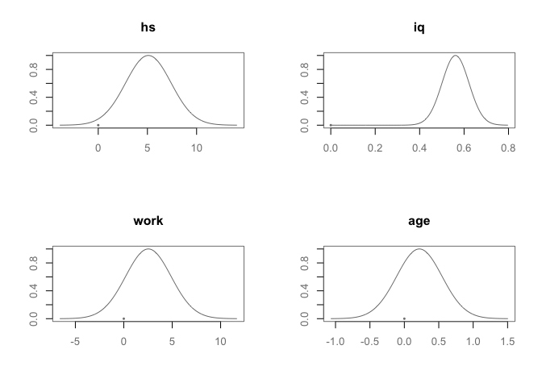

Bayesian multiple regression
================
Dr Merlise Clyde

**Read In Data and Preprocess**

The data are available as a "dta" file from Gelman's website. You will need to load the `foreign` library to be able to read the file in as a dataframe.

``` r
library(foreign)
cognitive = read.dta("http://www.stat.columbia.edu/~gelman/arm/examples/child.iq/kidiq.dta")
summary(cognitive)
```

    ##    kid_score         mom_hs           mom_iq          mom_work    
    ##  Min.   : 20.0   Min.   :0.0000   Min.   : 71.04   Min.   :1.000  
    ##  1st Qu.: 74.0   1st Qu.:1.0000   1st Qu.: 88.66   1st Qu.:2.000  
    ##  Median : 90.0   Median :1.0000   Median : 97.92   Median :3.000  
    ##  Mean   : 86.8   Mean   :0.7857   Mean   :100.00   Mean   :2.896  
    ##  3rd Qu.:102.0   3rd Qu.:1.0000   3rd Qu.:110.27   3rd Qu.:4.000  
    ##  Max.   :144.0   Max.   :1.0000   Max.   :138.89   Max.   :4.000  
    ##     mom_age     
    ##  Min.   :17.00  
    ##  1st Qu.:21.00  
    ##  Median :23.00  
    ##  Mean   :22.79  
    ##  3rd Qu.:25.00  
    ##  Max.   :29.00

The analyses in Course 3 used indicator variables for whether the mom worked for 1 or more years or had more than a high school education. The following code will create these dummy or indicator variables

``` r
cognitive$mom_work = as.numeric(cognitive$mom_work > 1)
cognitive$mom_hs =  as.numeric(cognitive$mom_hs > 0)
colnames(cognitive) = c("kid_score", "hs","iq", "work", "age") 
summary(cognitive)
```

    ##    kid_score           hs               iq              work       
    ##  Min.   : 20.0   Min.   :0.0000   Min.   : 71.04   Min.   :0.0000  
    ##  1st Qu.: 74.0   1st Qu.:1.0000   1st Qu.: 88.66   1st Qu.:1.0000  
    ##  Median : 90.0   Median :1.0000   Median : 97.92   Median :1.0000  
    ##  Mean   : 86.8   Mean   :0.7857   Mean   :100.00   Mean   :0.8226  
    ##  3rd Qu.:102.0   3rd Qu.:1.0000   3rd Qu.:110.27   3rd Qu.:1.0000  
    ##  Max.   :144.0   Max.   :1.0000   Max.   :138.89   Max.   :1.0000  
    ##       age       
    ##  Min.   :17.00  
    ##  1st Qu.:21.00  
    ##  Median :23.00  
    ##  Mean   :22.79  
    ##  3rd Qu.:25.00  
    ##  Max.   :29.00

*Note: you do not need to use the as.numeric function to convert them to 0 or 1 values and could leave them as TRUE/FALSE, however, since the "levels"" appear in the labels in the plot I converted them so that the labels were shorter. Similarly, the variable names were shortened also for cosmetic reasons for the slides only.*

### Fit the Bayesian model

We will use the `BAS` package to fit various Bayesian multiple regression models.

``` r
library(BAS)
cog.bas = bas.lm(kid_score ~ ., data=cognitive, 
                 prior="BIC", 
                 modelprior=Bernoulli(1), bestmodel=rep(1,5), 
                 n.models=1)
```

This uses a model formula as in `lm` to specify the response and predictor variables, a `data` argument to provide the data frame. The addition arguments include the prior on the coefficients. We will use `BIC` here as this is based on the non-informative reference prior. The modelprior says that every variable is included with probabilty 1; the argument of the `Bernoulli` function. Because we want to fit just the full model, we will use `bestmodel = rep(1,5)` where the ones indicate that the intercept and all 4 predictors are included. The argument `n.models=1` will fit just this model.

### Posterior means and standard deviations

To extract the posterior means and standard deviations we use the `coef` function.

``` r
cog.coef=coef(cog.bas)
cog.coef
```

    ## 
    ##  Marginal Posterior Summaries of Coefficients: 
    ##            post mean  post SD   post p(B != 0)
    ## Intercept  86.79724    0.87092   1.00000      
    ## hs          5.09482    2.31450   1.00000      
    ## iq          0.56147    0.06064   1.00000      
    ## work        2.53718    2.35067   1.00000      
    ## age         0.21802    0.33074   1.00000

The probability that the coefficients are not equal to 0 is 1, as our Bernoulli prior probability that they were included was 1, forcing them all to be included.

We can visualize the posterior distribution using the `plot` function.

``` r
myblue = rgb(86,155,189, name="myblue", max=256)
mydarkgrey = rgb(.5,.5,.5, name="mydarkgrey", max=1)
par(mfrow=c(2,2), col.lab=mydarkgrey, col.axis=mydarkgrey, col=mydarkgrey)

plot(cog.coef, subset=2:5, ask=F)
```



In this case we are plotting all coefficients, except the intercept using the `subset` argument. (One corresponds to the intercept.)

### Credible intervals

`BAS` has a method for extracting credible intervals from the output of `coef`.

``` r
confint(cog.coef)
```

    ##               2.5  %    97.5  %
    ## Intercept 85.0854390 88.5090310
    ## hs         0.5456507  9.6439990
    ## iq         0.4422784  0.6806616
    ## work      -2.0830879  7.1574454
    ## age       -0.4320547  0.8680925
    ## attr(,"Probability")
    ## [1] 0.95

``` r
confint(cog.coef, parm=2:5)
```

    ##          2.5  %   97.5  %
    ## hs    0.5456507 9.6439990
    ## iq    0.4422784 0.6806616
    ## work -2.0830879 7.1574454
    ## age  -0.4320547 0.8680925
    ## attr(,"Probability")
    ## [1] 0.95

The `parm` argument returns credible intervals for just the subset of indices provided, where `parm=1` is the intercept.

The table provided in the video combines the two summaries:

``` r
out = confint(cog.coef)
names =c("post mean", "post sd", colnames(out))
out = cbind(cog.coef$postmean, cog.coef$postsd, out)
colnames(out) = names
out
```

    ##            post mean   post sd     2.5  %    97.5  %
    ## Intercept 86.7972350 0.8709174 85.0854390 88.5090310
    ## hs         5.0948248 2.3145017  0.5456507  9.6439990
    ## iq         0.5614700 0.0606416  0.4422784  0.6806616
    ## work       2.5371788 2.3506717 -2.0830879  7.1574454
    ## age        0.2180189 0.3307406 -0.4320547  0.8680925

``` r
#  round output 
round(out[-1,], 2)
```

    ##      post mean post sd 2.5  % 97.5  %
    ## hs        5.09    2.31   0.55    9.64
    ## iq        0.56    0.06   0.44    0.68
    ## work      2.54    2.35  -2.08    7.16
    ## age       0.22    0.33  -0.43    0.87

If the coefficients for BIC models are obtained using `lm` the intercept will differ from above, as `BAS` uses a centered covariate parameterization for model fitting so that the intercept is always \(\bar{Y}\).
