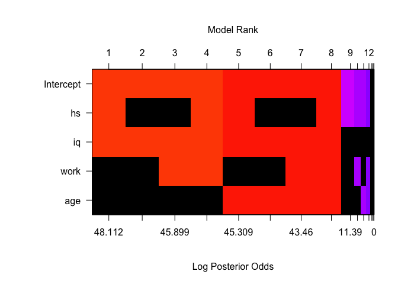
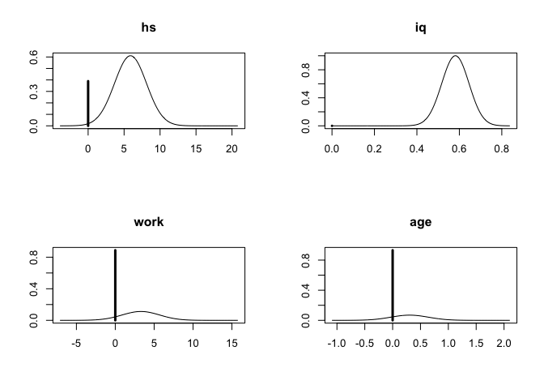

5.3.3 Bayesian model averaging
================
Dr. Merlise Clyde, Duke University

**Read In Data and Preprocess**

The data are available as a "dta" file from Gelman's website. You will need to load the `foreign` library to be able to read the file in as a dataframe.

``` r
library(foreign)
cognitive = read.dta("http://www.stat.columbia.edu/~gelman/arm/examples/child.iq/kidiq.dta")
summary(cognitive)
```

    ##    kid_score         mom_hs           mom_iq          mom_work    
    ##  Min.   : 20.0   Min.   :0.0000   Min.   : 71.04   Min.   :1.000  
    ##  1st Qu.: 74.0   1st Qu.:1.0000   1st Qu.: 88.66   1st Qu.:2.000  
    ##  Median : 90.0   Median :1.0000   Median : 97.92   Median :3.000  
    ##  Mean   : 86.8   Mean   :0.7857   Mean   :100.00   Mean   :2.896  
    ##  3rd Qu.:102.0   3rd Qu.:1.0000   3rd Qu.:110.27   3rd Qu.:4.000  
    ##  Max.   :144.0   Max.   :1.0000   Max.   :138.89   Max.   :4.000  
    ##     mom_age     
    ##  Min.   :17.00  
    ##  1st Qu.:21.00  
    ##  Median :23.00  
    ##  Mean   :22.79  
    ##  3rd Qu.:25.00  
    ##  Max.   :29.00

The analyses in Course 3 used indicator variables for whether the mom worked for 1 or more years or had more than a high school education. The following code will create these dummy or indicator variables

``` r
cognitive$mom_work = as.numeric(cognitive$mom_work > 1)
cognitive$mom_hs =  as.numeric(cognitive$mom_hs > 0)
colnames(cognitive) = c("kid_score", "hs","iq", "work", "age") 
summary(cognitive)
```

    ##    kid_score           hs               iq              work       
    ##  Min.   : 20.0   Min.   :0.0000   Min.   : 71.04   Min.   :0.0000  
    ##  1st Qu.: 74.0   1st Qu.:1.0000   1st Qu.: 88.66   1st Qu.:1.0000  
    ##  Median : 90.0   Median :1.0000   Median : 97.92   Median :1.0000  
    ##  Mean   : 86.8   Mean   :0.7857   Mean   :100.00   Mean   :0.8226  
    ##  3rd Qu.:102.0   3rd Qu.:1.0000   3rd Qu.:110.27   3rd Qu.:1.0000  
    ##  Max.   :144.0   Max.   :1.0000   Max.   :138.89   Max.   :1.0000  
    ##       age       
    ##  Min.   :17.00  
    ##  1st Qu.:21.00  
    ##  Median :23.00  
    ##  Mean   :22.79  
    ##  3rd Qu.:25.00  
    ##  Max.   :29.00

*Note: you do not need to use the as.numeric function to convert them to 0 or 1 values and could leave them as TRUE/FALSE, however, since the "levels"" appear in the labels in the plot I converted them so that the labels were shorter. Similarly, the variable names were shortened also for cosmetic reasons for the slides only.*

**Bayesian Model Averaging using BAS**

You will need to install the `BAS` package from `CRAN` and load the library.

``` r
library(BAS)
cog_bas = bas.lm(kid_score ~ hs + iq + work + age,
                prior="BIC",
                modelprior=uniform(),
                data=cognitive)
```

The object is of class `bas` for which there are `print`, `summary`, `plot`, `coef`, `fitted` and `predict` functions available. To visualize the space of models, use the `image` function.

``` r
image(cog_bas, rotate=F)
```



**Coefficient Summaries**

To calculate the posterior distributions of the coefficients, we use the `coef` function create an object with posterior means and standard deviations using BMA.

``` r
cog_coef = coef(cog_bas)
```

To plot the posterior distributions of the four regression coefficents, use the `plot` function.

``` r
par(mfrow=c(2,2))
plot(cog_coef, subset=c(2:5))
```



The optional subset argument lets you select which coefficients to plot from the indices `1:(p+1)`. In this case the intercept `subset=1` has been omitted to create the two by two array of plots.

To obtain the numerical summaries of means, standard deviations and posterior inclusion probabilites, simply type the name of the coefficient object.

``` r
cog_coef
```

    ## 
    ##  Marginal Posterior Summaries of Coefficients: 
    ##            post mean  post SD   post p(B != 0)
    ## Intercept  86.79724    0.87287   1.00000      
    ## hs          3.59494    3.35643   0.61064      
    ## iq          0.58101    0.06363   1.00000      
    ## work        0.36696    1.30939   0.11210      
    ## age         0.02089    0.11738   0.06898

*Note: `BAS` currently centers all covarites. This does not change the slope coefficients, however the intercept in all models is \(\bar{Y}\). *

Finally calculate the probabiliy that the coefficient for age is not zero. The marginal posterior inclusion probabilities are stored in the `bas` object as `probne0`.

*The intercept is always in position 1, so we need to add one to p to extract the last coefficient corresponding to the variable age.*
