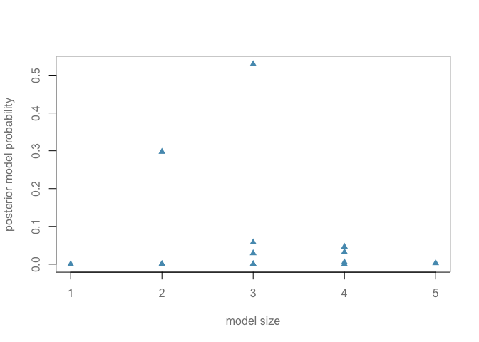

Stochastic Exploration
================
Dr Merlise Clyde, Duke University

Read in data and pre-process

``` r
library(foreign)
cognitive = read.dta("http://www.stat.columbia.edu/~gelman/arm/examples/child.iq/kidiq.dta")
cognitive$mom_work = as.numeric(cognitive$mom_work > 1)
cognitive$mom_hs =  as.numeric(cognitive$mom_hs > 0)
colnames(cognitive) = c("kid_score", "hs","iq", "work", "age") 
```

Run BAS

``` r
library(BAS)
cog_bas = bas.lm(kid_score ~ hs + iq + work + age,
                prior="BIC",
                modelprior=uniform(),
                data=cognitive)
```

Model Complexity

``` r
myblue = rgb(86,155,189, name="myblue", max=256)
mydarkgrey = rgb(.5,.5,.5, name="mydarkgrey", max=1)
plot(cog_bas$size, cog_bas$postprob, 
     xlab="model size", 
     ylab="posterior model probability", pch=17,
     col=myblue,
     col.lab=mydarkgrey,
     col.axis=mydarkgrey)
```



Animation code not available yet
