demo: crime and punishment
================

Load the data and preprocess

``` r
library(MASS)
data(UScrime)
summary(UScrime)
```

    ##        M               So               Ed             Po1       
    ##  Min.   :119.0   Min.   :0.0000   Min.   : 87.0   Min.   : 45.0  
    ##  1st Qu.:130.0   1st Qu.:0.0000   1st Qu.: 97.5   1st Qu.: 62.5  
    ##  Median :136.0   Median :0.0000   Median :108.0   Median : 78.0  
    ##  Mean   :138.6   Mean   :0.3404   Mean   :105.6   Mean   : 85.0  
    ##  3rd Qu.:146.0   3rd Qu.:1.0000   3rd Qu.:114.5   3rd Qu.:104.5  
    ##  Max.   :177.0   Max.   :1.0000   Max.   :122.0   Max.   :166.0  
    ##       Po2               LF             M.F              Pop        
    ##  Min.   : 41.00   Min.   :480.0   Min.   : 934.0   Min.   :  3.00  
    ##  1st Qu.: 58.50   1st Qu.:530.5   1st Qu.: 964.5   1st Qu.: 10.00  
    ##  Median : 73.00   Median :560.0   Median : 977.0   Median : 25.00  
    ##  Mean   : 80.23   Mean   :561.2   Mean   : 983.0   Mean   : 36.62  
    ##  3rd Qu.: 97.00   3rd Qu.:593.0   3rd Qu.: 992.0   3rd Qu.: 41.50  
    ##  Max.   :157.00   Max.   :641.0   Max.   :1071.0   Max.   :168.00  
    ##        NW              U1               U2             GDP       
    ##  Min.   :  2.0   Min.   : 70.00   Min.   :20.00   Min.   :288.0  
    ##  1st Qu.: 24.0   1st Qu.: 80.50   1st Qu.:27.50   1st Qu.:459.5  
    ##  Median : 76.0   Median : 92.00   Median :34.00   Median :537.0  
    ##  Mean   :101.1   Mean   : 95.47   Mean   :33.98   Mean   :525.4  
    ##  3rd Qu.:132.5   3rd Qu.:104.00   3rd Qu.:38.50   3rd Qu.:591.5  
    ##  Max.   :423.0   Max.   :142.00   Max.   :58.00   Max.   :689.0  
    ##       Ineq            Prob              Time             y         
    ##  Min.   :126.0   Min.   :0.00690   Min.   :12.20   Min.   : 342.0  
    ##  1st Qu.:165.5   1st Qu.:0.03270   1st Qu.:21.60   1st Qu.: 658.5  
    ##  Median :176.0   Median :0.04210   Median :25.80   Median : 831.0  
    ##  Mean   :194.0   Mean   :0.04709   Mean   :26.60   Mean   : 905.1  
    ##  3rd Qu.:227.5   3rd Qu.:0.05445   3rd Qu.:30.45   3rd Qu.:1057.5  
    ##  Max.   :276.0   Max.   :0.11980   Max.   :44.00   Max.   :1993.0

``` r
# see help(UScrime) for more information.  The variables have been standardized 
# so interpretation may be less meaningful in absolute terms. 
```

Log transform all continuous variables except `So` which is in column 2. We're overwriting the dataframe in this case.

``` r
#
UScrime[,-2] = log(UScrime[,-2])
```

### Run BAS

We are going to use the Zellner-Siow Cauchy prior

``` r
library(BAS)
crime.ZS =  bas.lm(y ~ ., 
                   data=UScrime,
                   prior="ZS-null",
                   modelprior=uniform(),
                   method = "MCMC") 
```

This will run the MCMC sampler until the number of uniques sampled models exceeds `n.models` which is \(2^p\) (if \(p < 19\)) by default or until `MCMC.iterations` has been exceeded, where `MCMC.iterations = n.models*2` by default.

### Estimates of Marginal Posterior Inclusion Probabilities (pip)

There are two estimates of the marginal inclusion probabilities: `object$probne0` which are obtained by using the renormalized posterior odds from sampled models to estimate probabilities and the estimates based on Monte Carlo frequencies `object$probs.MCMC`. These should be in close agreement if the MCMC sampler has run for enough iterations.

``` r
myblue = rgb(86,155,189, name="myblue", max=256)
mydarkgrey = rgb(.5,.5,.5, name="mydarkgrey", max=1)
plot(crime.ZS$probne0, crime.ZS$probs.MCMC, 
     xlab="pip (renormalized)", ylab="pip (MCMC)", 
     col=myblue,pch=16, cex=1.5, bty="n")
abline(0,1)
```

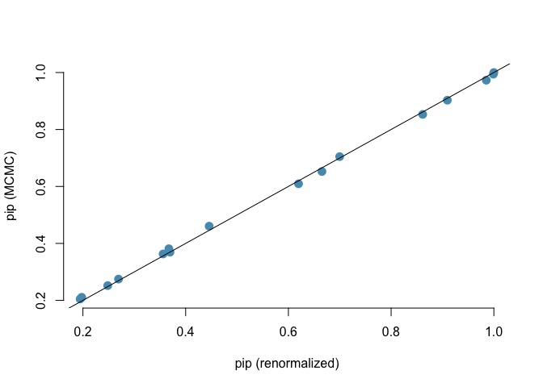

`BAS` includes a diagnostic function to automate this

``` r
diagnostics(crime.ZS, type="pip", col=myblue, pch=16, cex=1.5)
```

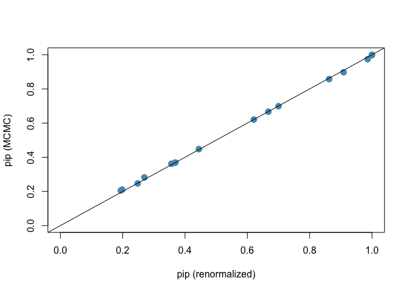

Each point represents one posterior inclusion probability for the 15 variables estimated under the two methods. The two estimators are in pretty close agreement.

We can also use this function to see if the model probabilities have converged

``` r
diagnostics(crime.ZS, type="model", col=myblue, pch=16, cex=1.5)
```

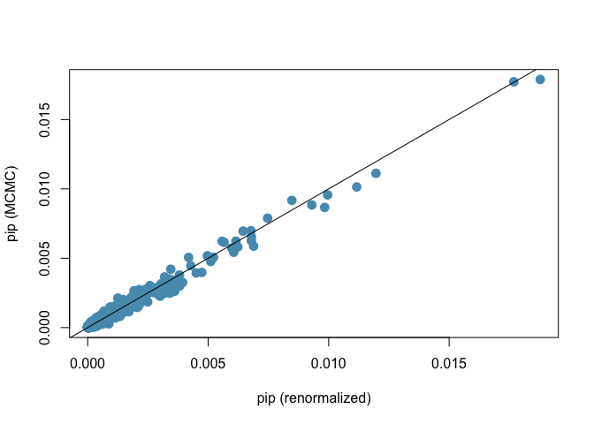

This suggests that we should use more `MCMC.iterations` if we want more accurate estimates of the posterior model probabilities.

### plots of BAS objects

BAS objects have a default plotting method:

``` r
par(mfrow=c(2,2))
plot(crime.ZS, ask=F, add.smooth=F, caption="", 
     col.in=myblue, col.ex=mydarkgrey, 
     pch=17, lwd=2)
```

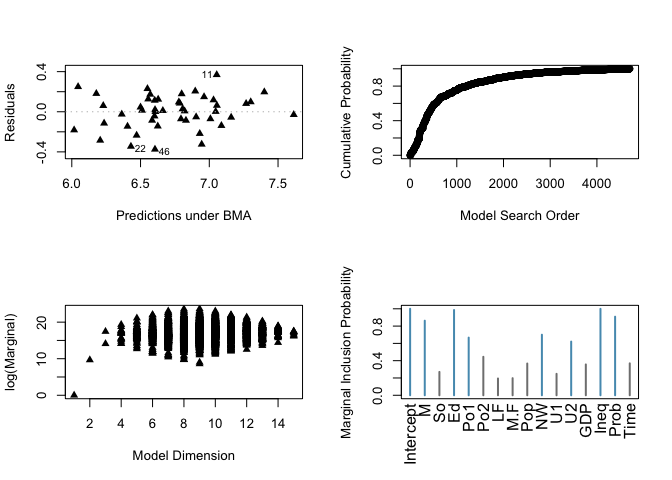

These may be slightly different than in the video due to Monte Carlo variation.

For the video we looked at them one at a time:

**Residuals versus fitted values using BMA**

``` r
plot(crime.ZS, which=1,add.smooth=F, ask=F, pch=16, sub.caption="", caption="")
```

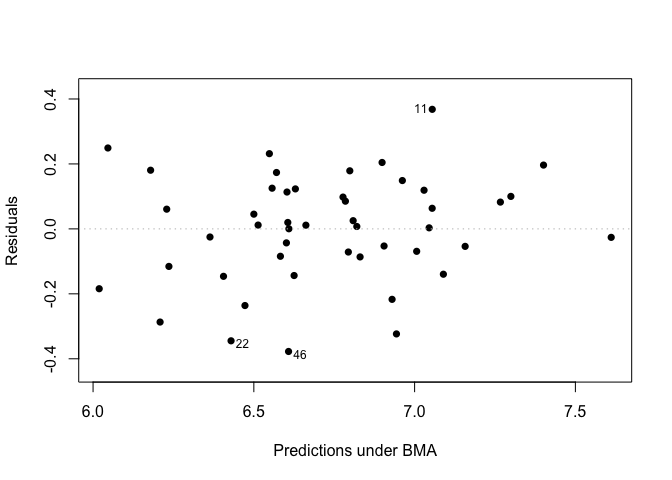

As with `lm` we would like to see a uniform spread of points for each fitted value indicating that the constant variance assumption is acceptable.

**Cumulative sampled probability**

``` r
plot(crime.ZS, which=2, add.smooth=F)
```

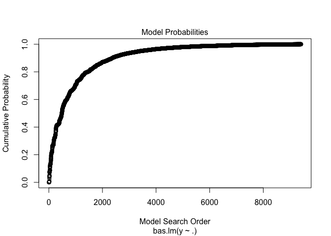

This is a plot of the cumulative probability of the unique models that were sampled where everytime a new model is discovered there is a jump in the cumulative probability. Ideally this levels off suggesting that each additional model has a very small probabilty and does not contribute substantially to the posterior distribution. *Try rerunning `bas.lm` using `method="BAS"` to see what happens with enumeration.*

**Model Complexity**

``` r
plot(crime.ZS, which=3, ask=F, caption="", sub.caption="")
```

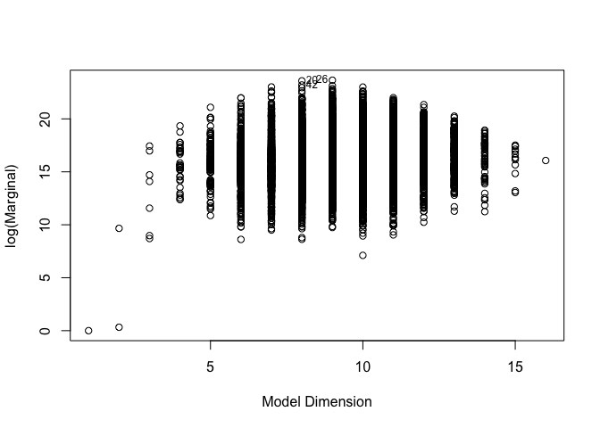

**Marginal Inclusion probabilities**

``` r
plot(crime.ZS, which=4, ask=F, caption="", sub.caption="", 
     col.in=myblue, col.ex=mydarkgrey, lwd=3)
```

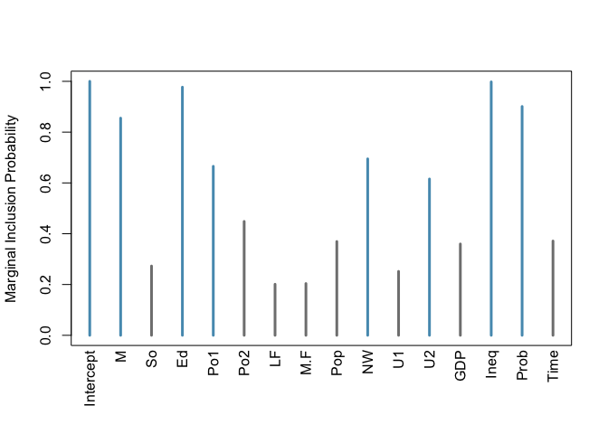

### Model Space Visualization

``` r
image(crime.ZS, rotate=F)
```

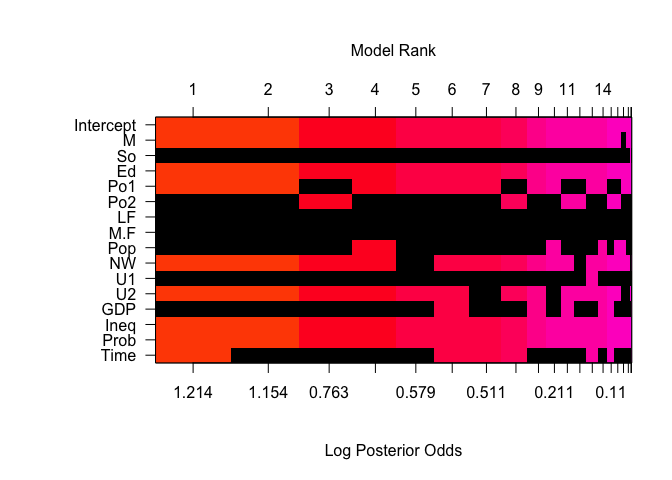

### Posterior Uncertainty in Coefficents

The function `coef` creates an object for BMA coefficients and summaries. We will look at the posterior distributions of just coefficients 5:6.

``` r
coef.ZS=coef(crime.ZS)

par(mfrow=c(1,2))
plot(coef.ZS, subset=c(5:6), 
     col.lab=mydarkgrey, 
     col.axis=mydarkgrey, 
     col=mydarkgrey, ask=F)
```

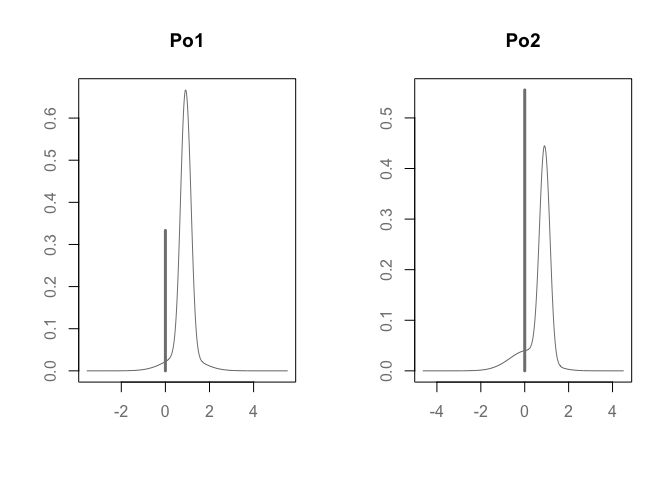

Using `plot(coef.ZS`) will produce plots for all coefficients in the model.

``` r
plot(coef.ZS)
```

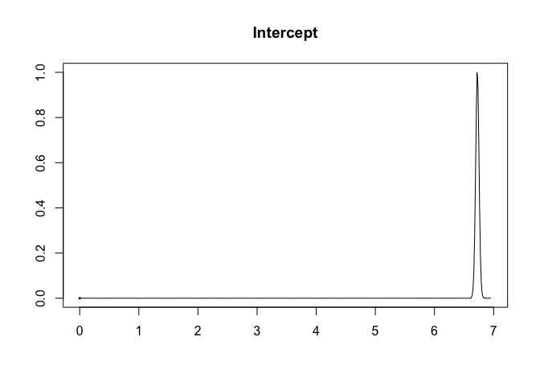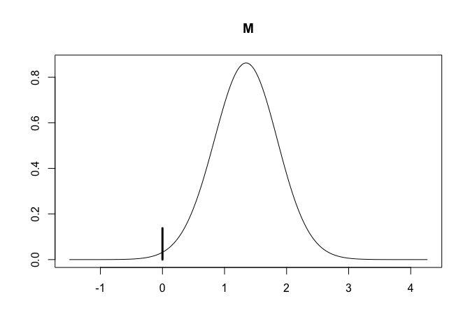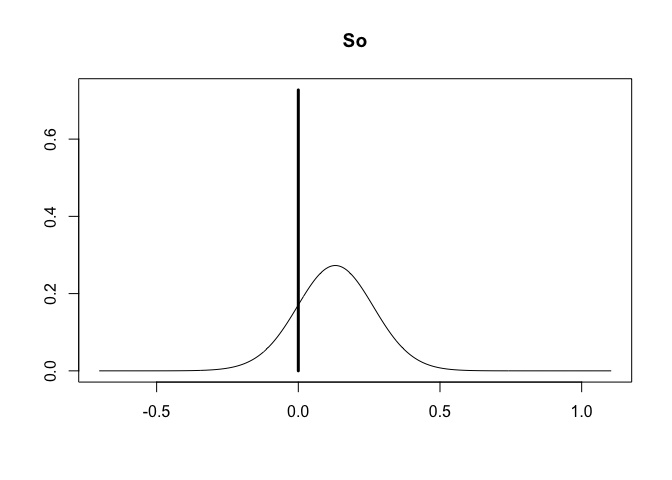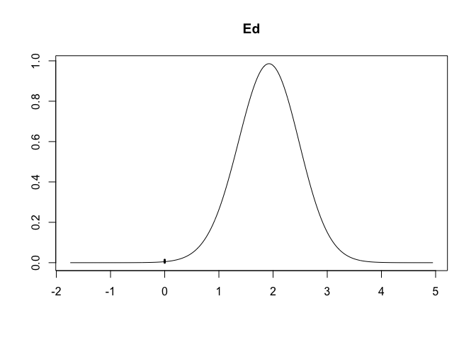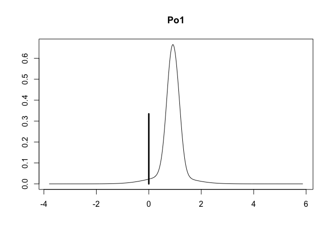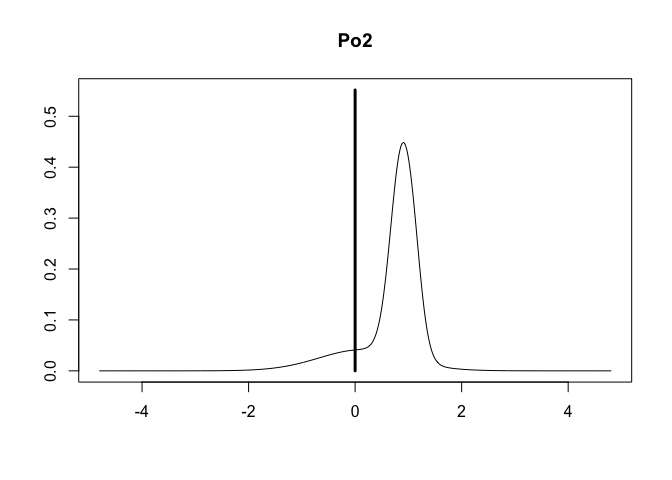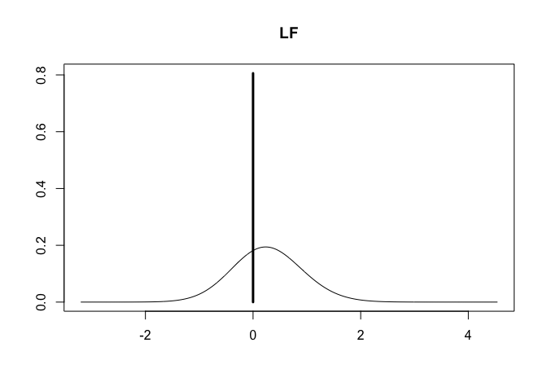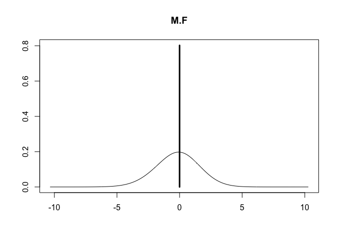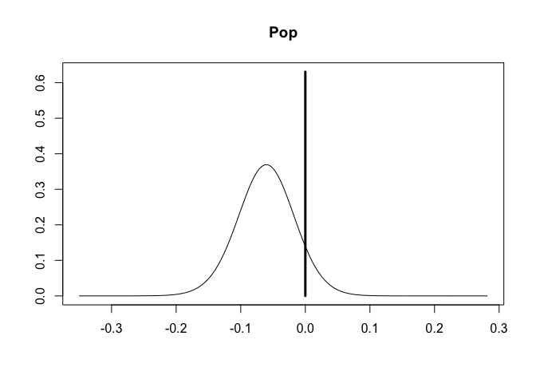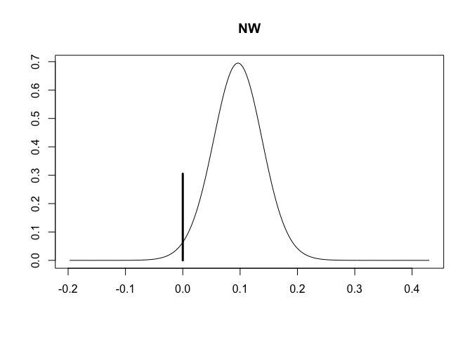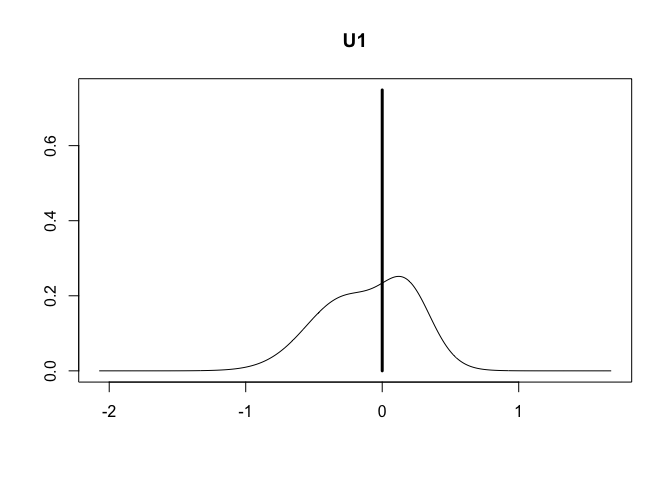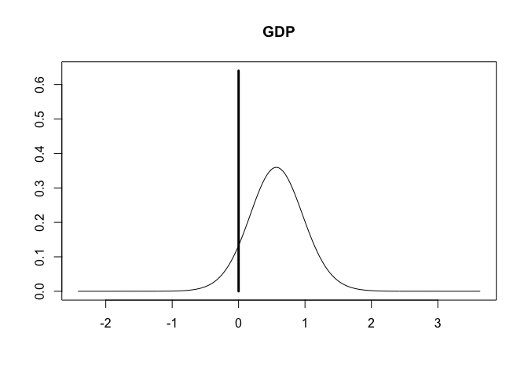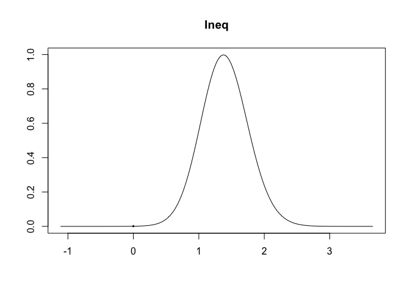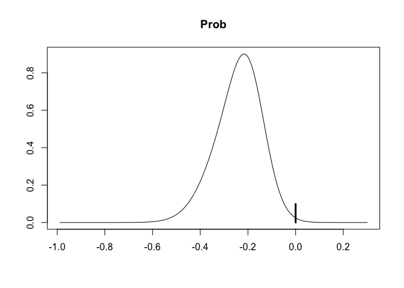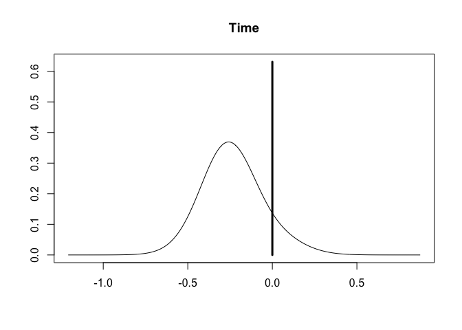
